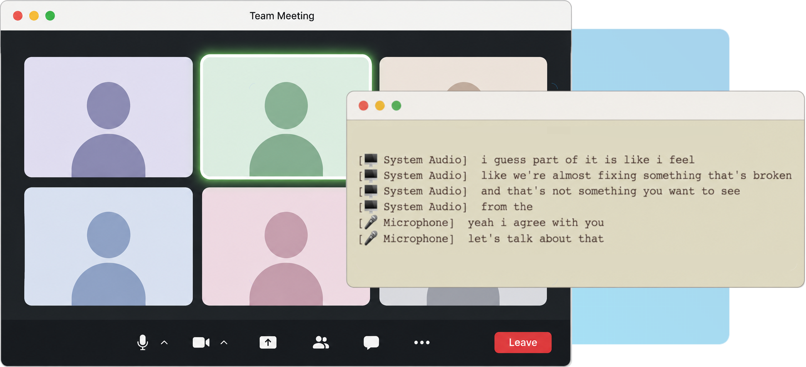

# ⑂ Splitstream

<p align="center">
  
</p>

Realtime native MacOS speech-to-text transcription library for mic and system audio simultaneously. Supports NVIDIA's Parakeet EOU (end-of-utterance) steaming model 🦜 and Deepgram.

## How it works
Splitstream taps into MacOS' low-level CoreAudio APIs via [cidre](https://crates.io/crates/cidre) to record system output. Optional echo cancellation powered by [SpeexDSP](https://github.com/xiph/speexdsp) keeps the mic channel clean even when audio is playing through speakers. Audio samples from both the mic and system audio are sent to a transcription model simulatenously and non-blocking.

#### 🤖 AI Disclaimer
*The crucial pieces of this library (core audio pipeline, audio capture, echo cancellation, transcription backend) were designed and written by a human. Docstrings and the refactoring that turned it into an importable Rust library was made with Claude.*

## Requirements

- **macOS 14.2+**: the audio tap API used for system audio capture only works for macOS 14.2 and beyond
- **Rust 1.80+**
- **Xcode Command Line Tools**: required to compile the audio and ML dependencies


## Getting Started
1. Install Splitstream on your Rust project

`cd example-project && cargo add splitstream`

#### ☁️ Deepgram (blazing fast, premium)
Instantiate Splitstream using `.with_deepgram(&api_key)` and provide your Deepgram API token.
```rust
use splitstream::{SplitStreamBuilder};

let (handle, mut rx) = SplitStreamBuilder::new()
        .with_deepgram("YOUR_DEEPGRAM_API_KEY_HERE")
        .echo_cancellation(true)
        .start()
        .await
```

#### 🦜Parakeet (local, free)
Make a `models` directory and install NVIDIA's `parakeet-eou` model from HuggingFace's `parakeet-rs` repo.

```bash
cargo run --bin download-parakeet
```

Then, instantiate Splitstream using `with_parakeet(&model_path)` and provide the path to the Parakeet model. In this case, it is `models/parakeet-eou`.
```rust
use splitstream::{SplitStreamBuilder};

let (handle, mut rx) = SplitStreamBuilder::new()
        .with_parakeet("models/parakeet-eou")
        .echo_cancellation(true)
        .start()
        .await
        .expect("failed to start splitstream");
```

## Example

```toml
# Cargo.toml
[dependencies]
splitstream = { git = "https://github.com/samuelokirby/splitstream" }
tokio = { version = "1", features = ["full"] }
```


```rust
# main.rs
use splitstream::{AudioSource, SplitStreamBuilder};

#[tokio::main]
async fn main() {
    let (handle, mut rx) = SplitStreamBuilder::new()
        .with_parakeet("path/to/parakeet-eou") // see "Getting the model" below
        .echo_cancellation(true) // enable SpeexDSP acoustic echo cancellation
        .start()
        .await
        .expect("failed to start splitstream");

    // Clean shutdown on Ctrl+C
    tokio::spawn(async move {
        tokio::signal::ctrl_c().await.ok();
        handle.shutdown();
    });

    while let Some(t) = rx.recv().await {
        let label = match t.source {
            AudioSource::Mic => "[🎤   Microphone] ",
            AudioSource::Sys => "[🖥️ System Audio] ",
        };
        println!("{} {}", label, t.text);
    }
}
```

---

## Transcription Support

| Backend | Method | Feature flag | Notes |
|---|---|---|---|
| **Parakeet** | `.with_parakeet(model_dir)` | `parakeet` *(default)* | Local ONNX inference |
| **Deepgram** | `.with_deepgram(api_key)` | *(always available)* | Cloud. Fastest, no local model needed. Requires API key. |

To use Deepgram only and skip compiling Parakeet:

```toml
splitstream = { git = "...", default-features = false }
```

---


## Mid-stream controls

The handle returned from `.start()` lets you toggle settings without stopping capture:

```rust
handle.set_mic_muted(true);          // silence the mic channel
handle.set_sys_muted(true);          // silence system audio (compliance mode)
handle.set_echo_cancellation(false); // toggle AEC on the fly
handle.shutdown();                   // stop everything cleanly
```

All of these take effect on the next 20ms tick and don't block.

---

## Running the CLI binary

If you just want to try it without writing any code, clone the repo and run it directly:

```bash
git clone https://github.com/samuelokirby/splitstream
cd splitstream
cargo run
```

Configure it via `settings.toml` in the working directory:

```toml
transcription_backend = "parakeet"   # "parakeet" | "deepgram" | "whisper"
echo_cancellation = true
compliance_mode_on_start = false     # start with sys audio muted

parakeet_model_dir = "./models/parakeet-eou"

# Required for Deepgram — or set DEEPGRAM_API_KEY in your environment
# api_key = "..."

# Required for Whisper
whisper_model_path = "./models/ggml-small.en.bin"
whisper_window_seconds = 3
```


---

## Feature flags

| Flag | Default | What it gates |
|---|---|---|
| `parakeet` | ✅ on | Parakeet ONNX inference (pulls in ORT + ONNX Runtime) |
| `whisper` | ❌ off | WIP |

---


